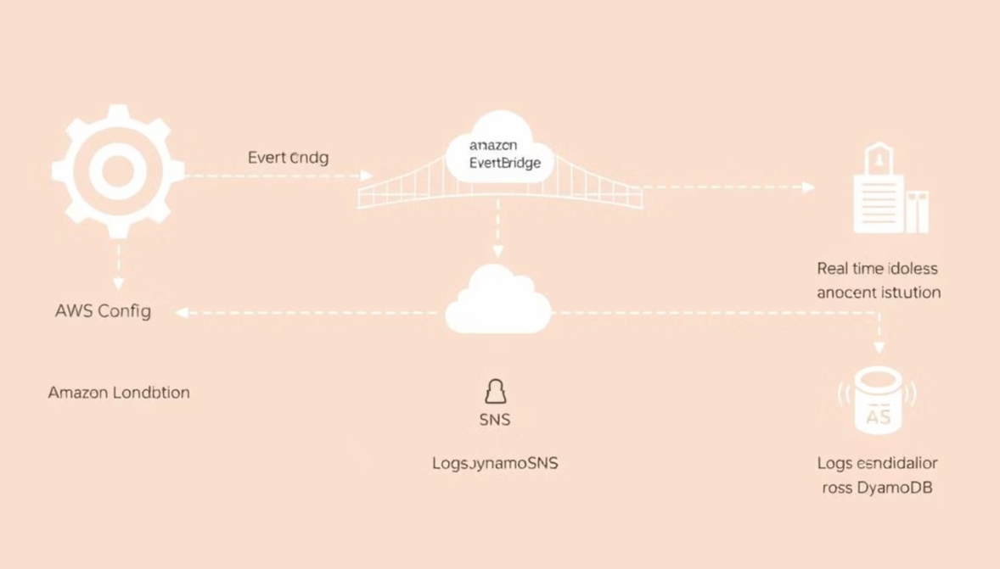

# 🛡️ AutoShield – Real-Time AWS Resource Exposure Monitor & Alert System

AutoShield is like a digital security guard for your AWS cloud . AutoShield is a **serverless cloud security monitoring system** built on core AWS services. It detects critical misconfigurations like public S3 buckets, open EC2 ports, or overly permissive IAM policies in **real time**, alerts administrators via email using SNS, and logs violations into DynamoDB for future analysis and dashboarding.

Designed for **DevSecOps**, **Cloud Engineers**, and **Security Teams**, AutoShield helps prevent accidental data leaks and compliance violations in dynamic cloud environments.

---

## 🚨 Real-World Risks Addressed

| ⚠️ Misconfiguration      | 🔍 What Can Go Wrong                                                   |
|--------------------------|------------------------------------------------------------------------|
| **Public S3 Bucket**     | Customer data or proprietary code exposed to the internet              |
| **Open EC2 Port (22/3389)** | Remote server access, brute-force attacks, and lateral movement       |
| **Unrestricted IAM Policy** | Privilege escalation and full-account compromise                     |
| **Unencrypted RDS/EBS**  | Sensitive database content exposed without encryption at rest          |

---

### 🛡️ Why AutoShield? — Key Features & Their Purpose

| 🚀 Feature | 📝 Description | 🎯 Why It Matters |
|-----------|----------------|------------------|
| **Real-Time Security Auditing** | AutoShield continuously listens for misconfiguration events (like public S3 buckets) via EventBridge. | Enables proactive detection instead of manual, delayed audits — increasing security posture. |
| **Serverless Architecture** | Built entirely on AWS Lambda, EventBridge, and DynamoDB with no servers to manage. | Ensures scalability, cost-efficiency, and minimal maintenance for continuous monitoring. |
| **DynamoDB-Powered Log Storage** | Misconfiguration findings are stored in a DynamoDB table. | Offers fast, scalable, and queryable access to historical security logs for audit/troubleshooting. |
| **DynbDashboard (Live Insights)** | A frontend dashboard displays logged events in real-time. | Provides immediate visibility and context for security teams or developers — no need to check logs manually. |
| **IAM + X-Ray + CloudWatch Integration** | IAM roles ensure least-privilege access, X-Ray helps trace execution, and CloudWatch tracks logs and alerts. | Guarantees end-to-end observability, traceability, and secure operations in production. |
| **S3 Misconfiguration Detection** | Specifically targets one of the most common AWS security risks: public S3 buckets. | Solves a real-world cloud security problem that leads to data leaks and compliance failures. |
| **EventBridge-Based Triggering** | Uses AWS EventBridge rules to trigger Lambda when relevant AWS events occur (e.g., S3 policy change). | Ensures instant response to misconfigurations — no delay or batch processing. |

## 🏗️ Architecture Overview :

> **Detection Flow**:  
`AWS Config → EventBridge → Lambda → SNS & DynamoDB`

- **AWS Config** evaluates resource compliance using managed rules  
- **EventBridge** routes non-compliance events  
- **Lambda** logs violations & triggers alerts  
- **SNS** notifies security teams (via email)  
- **DynamoDB** stores violations for dashboarding (DynbDashboard coming soon)

---

## ⚙️ Tech Stack

| AWS Service      | Role in the System                              |
|------------------|--------------------------------------------------|
| **AWS Lambda**    | Event processing & alert logic (Python)         |
| **AWS Config**    | Detects violations in AWS resources             |
| **Amazon EventBridge** | Routes violation events to Lambda         |
| **Amazon SNS**    | Sends email alerts                              |
| **Amazon DynamoDB** | Stores violation logs                         |
| **IAM Roles**     | Provides least-privilege access to services     |

---

## 🛠 Features

- ✅ **Real-Time Misconfiguration Detection**
- 🔁 **Event-driven architecture**
- 📬 **Immediate SNS Alerts via Email**
- 🗂️ **Logs every violation in DynamoDB**
- 🧱 **Modular & Scalable Lambda structure**
- 💡 **Infrastructure-as-Code** via AWS SAM (`template.yaml`)
- 🚫 **No third-party dependencies** – all AWS-native

## 🛡️ AutoShield – Contributions Welcome!

AutoShield is an open-source, serverless security auditing platform for AWS. We welcome contributions from cloud engineers, security enthusiasts, and DevSecOps professionals!

---

### 💡 Ideas You Can Work On

| 🔧 Feature Idea            | 📝 Description                                                                 |
|---------------------------|--------------------------------------------------------------------------------|
| 🔍 Multi-Resource Auditing | Extend AutoShield to audit EC2, IAM policies, and Security Groups along with S3 |
| 🧠 AI-based Risk Scoring   | Use ML to prioritize misconfigurations based on severity and historical trends  |
| 📊 Alert Dashboard Enhancements | Add sorting, filtering, and graph visualizations for easier insights    |
| 🔐 Role-Based Access       | Add authentication for different dashboard users (Admin vs Viewer)            |
| 📨 SNS/Slack Alerts        | Send real-time notifications to teams when critical issues are detected       |
| 📦 Archive to S3           | Automatically back up old logs to S3 Glacier for cost-efficient storage        |

---

### 🛠️ How to Contribute

- 🍴 Fork the repo  
- 📦 Create a new feature branch: `git checkout -b feature-name`  
- ✅ Make your changes and test them  
- 📬 Submit a pull request describing your enhancement  

---

### 🤝 Let’s Make Cloud Safer Together!

Made with ❤️ by **Manas Gantait**

---

### 🔍 About AutoShield

- 🌩️ Serverless AWS Monitoring  
- 🔐 Real-Time Misconfiguration Detection  
- 📚 DynamoDB-backed Security Logs  
- 📈 Live DynbDashboard Visualization  
- 🔁 EventBridge + Lambda Driven  
- 📦 Open Source – Fully Extendable  
- 🧭 Cloud-Native, DevOps-Ready  
- 🛠️ Built for Scale and Observability  

