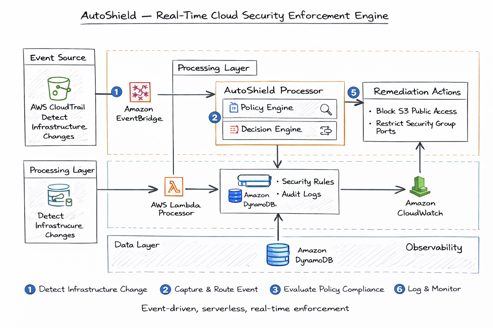

# 🛡️ AutoShield – Real Time AWS Resource Exposure Monitor & Alert System

AutoShield is like a digital security guard for your AWS cloud . AutoShield is a **serverless cloud security monitoring system** built on core AWS services. It detects critical misconfigurations like public S3 buckets, open EC2 ports, or overly permissive IAM policies in **real time**, alerts administrators via email using SNS, and logs violations into DynamoDB for future analysis and dashboarding.

## 🎯 Why This Project Exists
Modern cloud environments fail not because of lack of tools — but because of **lack of enforcement**.

- Alerts are generated → ignored  
- Dashboards show issues → no action taken  
- Manual remediation → too slow  

AutoShield solves this by **closing the gap between detection and action**.
It ensures:
> If something becomes insecure → it is fixed automatically.

## ⚖️ Problem vs Solution :

| Real-World Problem (What actually happens in cloud teams)              | AutoShield Approach (What this system enforces)                     |
|----------------------------------------------------------------------|--------------------------------------------------------------------|
| Misconfigured resources (e.g., public S3, open security groups) stay unnoticed for hours or days | Detects changes instantly via EventBridge and evaluates in real time |
| Security alerts are generated but ignored due to alert fatigue        | Eliminates alert dependency by triggering automatic remediation     |
| Manual remediation depends on engineers’ availability and response time | Executes fixes automatically using Lambda (no human dependency)     |
| Different engineers fix issues differently → inconsistent security posture | Enforces standardized, policy-driven remediation logic              |
| Periodic scans (cron jobs, audits) miss real-time exposure windows    | Event-driven model ensures zero-delay detection and response        |
| Scaling security checks across hundreds of resources is operationally expensive | Serverless architecture scales automatically per event load         |
| Lack of audit clarity on who fixed what and when                      | Logs every action in DynamoDB + CloudWatch for traceability         |


### 🛡️ Why AutoShield? — Core Features :

| 🚀 Feature | 📝 Description | 🎯 Why It Matters |
|-----------|----------------|------------------|
| **Real-Time Security Auditing** | AutoShield continuously listens for misconfiguration events (like public S3 buckets) via EventBridge. | Enables proactive detection instead of manual, delayed audits — increasing security posture. |
| **Serverless Architecture** | Built entirely on AWS Lambda, EventBridge, and DynamoDB with no servers to manage. | Ensures scalability, cost-efficiency, and minimal maintenance for continuous monitoring. |
| **DynamoDB-Powered Log Storage** | Misconfiguration findings are stored in a DynamoDB table. | Offers fast, scalable, and queryable access to historical security logs for audit/troubleshooting. |
| **DynbDashboard (Live Insights)** | A frontend dashboard displays logged events in real-time. | Provides immediate visibility and context for security teams or developers — no need to check logs manually. |
| **IAM + X-Ray + CloudWatch Integration** | IAM roles ensure least-privilege access, X-Ray helps trace execution, and CloudWatch tracks logs and alerts. | Guarantees end-to-end observability, traceability, and secure operations in production. |
| **S3 Misconfiguration Detection** | Specifically targets one of the most common AWS security risks: public S3 buckets. | Solves a real-world cloud security problem that leads to data leaks and compliance failures. |
| **EventBridge-Based Triggering** | Uses AWS EventBridge rules to trigger Lambda when relevant AWS events occur (e.g., S3 policy change). | Ensures instant response to misconfigurations — no delay or batch processing. |


## 🏗️ Architecture Diagram :



## 🧰 Tech Stack

- **Cloud:** AWS  
- **Compute:** AWS Lambda (stateless execution)  
- **Event Bus:** Amazon EventBridge  
- **Storage:** DynamoDB (rules + audit logs)  
- **Monitoring:** CloudWatch  
- **Language:** Python  
- **IaC:** Terraform (optional but recommended)

## ⚡ Quickstart (30-Second Run)

```bash
# Clone repository
git clone https://github.com/your-username/autoshield.git

# Deploy infrastructure
cd infra
terraform init && terraform apply

# Deploy Lambda
cd ../services
zip function.zip lambda_function.py
aws lambda update-function-code \
  --function-name autoshield \
  --zip-file fileb://function.zip

# Send test event
aws events put-events --entries file://event.json

```

## ☁️ Infrastructure & Cloud :

***AWS Lambda:***
- Core execution engine (detection + remediation)
- Fully stateless and auto-scaled
- Handles event processing and remediation logic

***Amazon EventBridge:***
- Real-time event ingestion and routing
- Captures infrastructure changes instantly
- Decouples event producers from processing logic

***Amazon DynamoDB:***
- Stores:
  - Security rules
  - Execution logs
  - Audit history
- Low-latency, high-throughput data access

***Amazon CloudWatch:***
- Observability layer
- Logs, metrics, and failure tracking
- Enables debugging and monitoring


## 🔄 Request Lifecycle :

1. Cloud resource change occurs (e.g., S3 becomes public)  
2. EventBridge captures the event in real time  
3. Lambda processes the incoming event  
4. Policy engine evaluates rule compliance  
5. Violation detected → remediation triggered  
6. Action executed (e.g., block public access)  
7. Result logged in DynamoDB and CloudWatch for traceability

***⚙️ Remediation Logic (Example):***
Example: Blocking public S3 access

```python
if bucket_is_public:
    s3.put_public_access_block(
        Bucket=bucket_name,
        PublicAccessBlockConfiguration={
            'BlockPublicAcls': True,
            'IgnorePublicAcls': True,
            'BlockPublicPolicy': True,
            'RestrictPublicBuckets': True
        }
    )
```

## 💡 Why This Design? :

- **Event-driven architecture**  
  → Zero delay between issue and response  

- **Serverless execution**  
  → No infrastructure management, automatic scaling  

- **Policy abstraction**  
  → Rules are decoupled from execution logic  

- **Decoupled components**  
  → Improves fault isolation and maintainability

**🧠 Rule Engine Design:**

Rules are stored and evaluated dynamically instead of hardcoding logic.
```
Example:
{
  "resource": "S3",
  "condition": "public == true",
  "action": "block_public_access"
}
```
- Lambda fetches rules from DynamoDB
- Evaluates incoming events against rules
- Triggers mapped remediation actions
This keeps detection logic flexible and extensible.


## 🛡️ Resilience & Security :

***Failure Handling***
- Event retries handled via EventBridge  
- Failed remediations logged for traceability  
- Idempotent execution prevents duplicate actions  

***Security Design:***
- IAM roles follow least-privilege principle  
- Strict event validation before execution  
- No hardcoded or embedded credentials  

***Scalability Thinking:***
- Lambda scales automatically per event volume  
- DynamoDB supports high-throughput workloads  
- System remains stable under burst traffic  

## 🧠 Engineering Philosophy :

***Key Decisions:***
- **Event-driven > Scheduled scanning**  
  → Real-time enforcement instead of delayed detection  

- **Serverless > Containers**  
  → Reduced operational overhead, faster execution  

- **Deterministic rules > ML-based decisions**  
  → Predictability and control over automation  

***Trade-offs:***
- No predictive intelligence (by design)  
- Limited to defined rule coverage  
- Requires strong IAM design to avoid over-permissioning  

 ***Explicit Limitations:***
- Does not detect unknown threat patterns  
- No UI/dashboard (intentionally backend-focused)  
- Depends on event availability (not periodic scans)  
 

## 🛡️ AutoShield – Contributions Welcome!

AutoShield is an open-source, serverless security auditing platform for AWS. We welcome contributions from cloud engineers, security enthusiasts, and DevSecOps professionals!

### 💡 Ideas You Can Work On

| 🔧 Feature Idea            | 📝 Description                                                                 |
|---------------------------|--------------------------------------------------------------------------------|
| 🔍 Multi-Resource Auditing | Extend AutoShield to audit EC2, IAM policies, and Security Groups along with S3 |
| 🧠 AI-based Risk Scoring   | Use ML to prioritize misconfigurations based on severity and historical trends  |
| 📊 Alert Dashboard Enhancements | Add sorting, filtering, and graph visualizations for easier insights    |
| 🔐 Role-Based Access       | Add authentication for different dashboard users (Admin vs Viewer)            |
| 📨 SNS/Slack Alerts        | Send real-time notifications to teams when critical issues are detected       |
| 📦 Archive to S3           | Automatically back up old logs to S3 Glacier for cost-efficient storage        |


### 🛠️ How to Contribute

- 🍴 Fork the repo  
- 📦 Create a new feature branch: `git checkout -b feature-name`  
- ✅ Make your changes and test them  
- 📬 Submit a pull request describing your enhancement  

### 🤝 Let’s Make Cloud Safer Together!
Made with ❤️ by **Manas Gantait**
